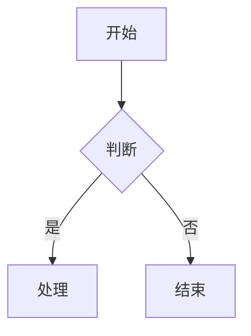

# 阶段一：主题皮肤 + Mermaid + 目录层级

> **For agentic workers:** REQUIRED SUB-SKILL: Use superpowers:subagent-driven-development (recommended) or superpowers:executing-plans to implement this plan task-by-task. Steps use checkbox (`- [ ]`) syntax for tracking.

**Goal:** 实现主题皮肤切换、Mermaid 图表渲染、目录递归扫描 + 树形 UI + 本地/远程双 Tab

**Architecture:** 主题系统通过 TypeScript 主题注册表 + 运行时 CSS 变量设置实现；Mermaid 通过懒加载 + 自定义 code 组件实现；目录层级通过 Rust 后端递归扫描 + 前端树形组件实现

**Tech Stack:** React 19, TypeScript, Tailwind v4, Rust (Tauri 2), mermaid.js

---

### Task 1: 主题注册表 `themes.ts`

**Files:**

- Create: `src/features/themes.ts`

- [ ] **Step 1: 创建主题注册表文件**

在 `src/features/themes.ts` 中定义 `ThemeDef` 接口和 `THEMES` 数组，包含 4 个主题：花笺白(light)、墨夜(dark)、Solarized Light、Nord Dark。每个主题定义全部 17 个颜色变量。

颜色值提取自 `App.css` 的 `@theme` 块（亮色默认值）和 `:root[data-theme="dark"]` 块（暗色覆盖值）。Solarized 和 Nord 的值来自公开配色方案。

```ts
export interface ThemeDef {
  id: string;
  name: string;
  type: "light" | "dark";
  colors: Record<string, string>;
}

export const THEMES: ThemeDef[] = [
  {
    id: "light",
    name: "花笺白",
    type: "light",
    colors: {
      "color-paper": "#f6f3ec",
      "color-paper-warm": "#f0ebe0",
      "color-paper-deep": "#e8e1d3",
      "color-ink": "#1a1a18",
      "color-ink-soft": "#3d3d38",
      "color-ink-faint": "#8a8a80",
      "color-ink-ghost": "#b8b8ae",
      "color-bamboo": "#2d5a3d",
      "color-bamboo-light": "#3a7a52",
      "color-bamboo-mist": "#e8f0eb",
      "color-bamboo-glow": "#d4e8da",
      "color-stone": "#6b6b62",
      "color-cloud": "#ffffff",
      "color-shadow": "rgba(26, 26, 24, 0.06)",
      "color-shadow-deep": "rgba(26, 26, 24, 0.12)",
      "color-danger-bg": "#fef2f2",
    },
  },
  {
    id: "dark",
    name: "墨夜",
    type: "dark",
    colors: {
      "color-paper": "#222120",
      "color-paper-warm": "#2c2a27",
      "color-paper-deep": "#3c3935",
      "color-ink": "#e5e1da",
      "color-ink-soft": "#b5b1a8",
      "color-ink-faint": "#928f87",
      "color-ink-ghost": "#706d67",
      "color-bamboo": "#4faa70",
      "color-bamboo-light": "#5fc085",
      "color-bamboo-mist": "#1c2e22",
      "color-bamboo-glow": "#243a2c",
      "color-stone": "#8a8880",
      "color-cloud": "#1a1917",
      "color-shadow": "rgba(0, 0, 0, 0.3)",
      "color-shadow-deep": "rgba(0, 0, 0, 0.5)",
      "color-danger-bg": "rgba(220, 38, 38, 0.15)",
    },
  },
  {
    id: "solarized-light",
    name: "Solarized Light",
    type: "light",
    colors: {
      "color-paper": "#fdf6e3",
      "color-paper-warm": "#eee8d5",
      "color-paper-deep": "#ddd6c1",
      "color-ink": "#657b83",
      "color-ink-soft": "#839496",
      "color-ink-faint": "#93a1a1",
      "color-ink-ghost": "#b0b0a0",
      "color-bamboo": "#268bd2",
      "color-bamboo-light": "#2e9ee6",
      "color-bamboo-mist": "#e3f0f5",
      "color-bamboo-glow": "#d0e8f0",
      "color-stone": "#7f8c8e",
      "color-cloud": "#fdf8ee",
      "color-shadow": "rgba(101, 123, 131, 0.06)",
      "color-shadow-deep": "rgba(101, 123, 131, 0.12)",
      "color-danger-bg": "#fef2f2",
    },
  },
  {
    id: "nord-dark",
    name: "Nord Dark",
    type: "dark",
    colors: {
      "color-paper": "#2e3440",
      "color-paper-warm": "#3b4252",
      "color-paper-deep": "#434c5e",
      "color-ink": "#eceff4",
      "color-ink-soft": "#d8dee9",
      "color-ink-faint": "#a3be8c",
      "color-ink-ghost": "#7b88a1",
      "color-bamboo": "#88c0d0",
      "color-bamboo-light": "#8fbcbb",
      "color-bamboo-mist": "#2e3a40",
      "color-bamboo-glow": "#354550",
      "color-stone": "#6d7a8a",
      "color-cloud": "#2e3440",
      "color-shadow": "rgba(0, 0, 0, 0.3)",
      "color-shadow-deep": "rgba(0, 0, 0, 0.5)",
      "color-danger-bg": "rgba(191, 97, 106, 0.15)",
    },
  },
];

export function getThemeById(id: string): ThemeDef | undefined {
  return THEMES.find((t) => t.id === id);
}
```

- [ ] **Step 2: 提交**

```bash
git add src/features/themes.ts
git commit -m "feat(themes): 新增主题注册表 — 花笺白/墨夜/Solarized Light/Nord Dark"
```

---

### Task 2: 改造 `theme.ts` 和 `types.ts`

**Files:**

- Modify: `src/features/settings/types.ts`
- Modify: `src/features/settings/theme.ts`
- Modify: `src/features/settings/tileColor.ts`

- [ ] **Step 1: 扩展 ThemeOption 类型**

在 `src/features/settings/types.ts` 中将 `ThemeOption` 从联合类型改为 `string`：

```ts
export type ThemeOption = string;
```

保留 `"light"`, `"dark"`, `"system"` 作为约定值，不再用联合类型约束。

- [ ] **Step 2: 改造 theme.ts**

在 `src/features/settings/theme.ts` 中增加 `applyThemeColors` 函数，改造 `applyTheme` 支持主题 id：

```ts
import { getThemeById } from "../themes";

function applyThemeColors(colors: Record<string, string>): void {
  const root = document.documentElement;
  for (const [key, value] of Object.entries(colors)) {
    root.style.setProperty(`--${key}`, value);
  }
}

export function applyTheme(option: ThemeOption): void {
  const root = document.documentElement;

  if (option === "system") {
    const prefersDark = window.matchMedia("(prefers-color-scheme: dark)").matches;
    const themeId = prefersDark ? "dark" : "light";
    const theme = getThemeById(themeId);
    if (theme) {
      applyThemeColors(theme.colors);
      root.setAttribute("data-theme", themeId);
    }
  } else {
    const theme = getThemeById(option);
    if (theme) {
      applyThemeColors(theme.colors);
      root.setAttribute("data-theme", option);
    }
  }

  localStorage.setItem("theme-option", option);
  if (option !== "system") {
    localStorage.setItem("theme-resolved", option);
  }
}
```

- [ ] **Step 3: 改造 tileColor.ts**

在 `src/features/settings/tileColor.ts` 中，将 `resolveSystemTileColor` 改为通过主题注册表判断：

```ts
import { getThemeById } from "../themes";

export function resolveSystemTileColor(): string {
  if (typeof document === "undefined") return SYSTEM_TILE_COLOR_LIGHT;
  const themeId = document.documentElement.getAttribute("data-theme") || "light";
  const theme = getThemeById(themeId);
  if (theme?.type === "dark") return SYSTEM_TILE_COLOR_DARK;
  return SYSTEM_TILE_COLOR_LIGHT;
}
```

- [ ] **Step 4: 提交**

```bash
git add src/features/settings/types.ts src/features/settings/theme.ts src/features/settings/tileColor.ts
git commit -m "feat(themes): 主题系统支持多皮肤注册表 + 明暗快捷切换"
```

---

### Task 3: index.html 阻塞脚本内联默认主题

**Files:**

- Modify: `index.html`

- [ ] **Step 1: 修改 index.html 阻塞脚本**

将 `index.html` 中的阻塞脚本从简单的 `data-theme` 设置改为内联花笺白的 colors，通过 `style.setProperty` 设置 CSS 变量：

```html
<script>
  (function () {
    var opt = localStorage.getItem("theme-option");
    var root = document.documentElement;
    var defaultColors = {
      "color-paper": "#f6f3ec",
      "color-paper-warm": "#f0ebe0",
      "color-paper-deep": "#e8e1d3",
      "color-ink": "#1a1a18",
      "color-ink-soft": "#3d3d38",
      "color-ink-faint": "#8a8a80",
      "color-ink-ghost": "#b8b8ae",
      "color-bamboo": "#2d5a3d",
      "color-bamboo-light": "#3a7a52",
      "color-bamboo-mist": "#e8f0eb",
      "color-bamboo-glow": "#d4e8da",
      "color-stone": "#6b6b62",
      "color-cloud": "#ffffff",
      "color-shadow": "rgba(26, 26, 24, 0.06)",
      "color-shadow-deep": "rgba(26, 26, 24, 0.12)",
      "color-danger-bg": "#fef2f2",
    };
    for (var key in defaultColors) {
      root.style.setProperty("--" + key, defaultColors[key]);
    }
    var t;
    if (opt === "light" || opt === "dark" || opt === "system") {
      if (opt === "system") {
        t = window.matchMedia("(prefers-color-scheme: dark)").matches ? "dark" : "light";
      } else {
        t = opt;
      }
    } else {
      t = "light";
    }
    root.setAttribute("data-theme", t);
  })();
</script>
```

- [ ] **Step 2: 提交**

```bash
git add index.html
git commit -m "feat(themes): index.html 阻塞脚本内联默认主题颜色变量"
```

---

### Task 4: 主题选择器 UI + 明暗切换按钮 + 快捷键

**Files:**

- Modify: `src/components/SettingsPanel.tsx`
- Modify: `src/components/MainWindow.tsx`
- Modify: `src/locales/zh-CN/translation.json`
- Modify: `src/locales/en-US/translation.json`
- Modify: `src/locales/zh-HK/translation.json`

- [ ] **Step 1: 扩展 i18n 翻译**

在三个 locale 文件的 `settings` 段中增加主题名称翻译。在 `zh-CN/translation.json` 的 `settings.theme` 中追加：

```json
"solarized-light": "Solarized Light",
"nord-dark": "Nord Dark",
"customTheme": "自定义主题",
"themeGallery": "主题画廊"
```

在 `en-US/translation.json` 的 `settings.theme` 中追加：

```json
"solarized-light": "Solarized Light",
"nord-dark": "Nord Dark",
"customTheme": "Custom Theme",
"themeGallery": "Theme Gallery"
```

在 `zh-HK/translation.json` 的 `settings.theme` 中追加：

```json
"solarized-light": "Solarized Light",
"nord-dark": "Nord Dark",
"customTheme": "自訂主題",
"themeGallery": "主題畫廊"
```

- [ ] **Step 2: SettingsPanel 增加主题选择器**

在 `src/components/SettingsPanel.tsx` 中，将现有的 `themeOptions` 从硬编码三个选项改为从 `THEMES` 数组动态生成。在主题选项下方增加主题画廊网格：

```tsx
import { THEMES } from "../features/themes";
import type { ThemeOption } from "../features/settings/types";

// 替换原来的 themeOptions：
const themeOptions = useMemo<Array<{ value: ThemeOption; label: string }>>(
  () => THEMES.map((t) => ({ value: t.id, label: t.name })),
  [],
);
```

增加主题画廊 UI（网格预览卡，每个主题显示 5 个色块预览）：

```tsx
<div className="grid grid-cols-2 gap-2 mt-2">
  {THEMES.map((theme) => (
    <button
      key={theme.id}
      onClick={() => {
        setConfigValue("theme", theme.id);
        applyTheme(theme.id);
      }}
      className={`flex items-center gap-2 p-2 rounded-lg border transition-colors ${
        config.theme === theme.id
          ? "border-bamboo bg-bamboo-mist/50"
          : "border-paper-deep hover:border-stone"
      }`}
    >
      <div className="flex gap-0.5 shrink-0">
        {[
          theme.colors["color-paper"],
          theme.colors["color-ink"],
          theme.colors["color-bamboo"],
          theme.colors["color-paper-warm"],
          theme.colors["color-bamboo-light"],
        ].map((c, i) => (
          <div
            key={i}
            className="w-3 h-6 first:rounded-l last:rounded-r"
            style={{ backgroundColor: c }}
          />
        ))}
      </div>
      <span className="text-[11px] text-ink-soft truncate">{theme.name}</span>
    </button>
  ))}
</div>
```

在明暗切换区域保留 SlidingButtonGroup（浅色/深色/跟随系统），作为快捷切换。

- [ ] **Step 3: 标题栏明暗切换按钮**

在 `src/components/MainWindow.tsx` 的标题栏区域（窗口控制按钮旁），增加一个明暗切换按钮。按钮图标用太阳/月亮 SVG，点击在 `"light"` 和 `"dark"` 之间切换。

快捷键 `Ctrl+Shift+T`（macOS 为 `Cmd+Shift+T`）。

在 `useEffect` 中监听 `keydown` 事件：

```tsx
useEffect(() => {
  const handler = (e: KeyboardEvent) => {
    if ((e.metaKey || e.ctrlKey) && e.shiftKey && e.key.toLowerCase() === "t") {
      e.preventDefault();
      const current = localStorage.getItem("theme-option") || "light";
      const next = current === "dark" ? "light" : "dark";
      applyTheme(next);
    }
  };
  window.addEventListener("keydown", handler);
  return () => window.removeEventListener("keydown", handler);
}, []);
```

- [ ] **Step 4: 提交**

```bash
git add src/components/SettingsPanel.tsx src/components/MainWindow.tsx src/locales/
git commit -m "feat(themes): 主题画廊 UI + 标题栏明暗切换按钮 + Ctrl+Shift+T 快捷键"
```

---

### Task 5: GFM Alert 多主题适配

**Files:**

- Modify: `src/App.css`

- [ ] **Step 1: 将 GFM Alert 暗色覆盖改为 CSS 变量驱动**

`App.css` 末尾的 `:root[data-theme="dark"] .markdown-alert-*` 覆盖块需要移除，改为在各主题的 `colors` 中定义 Alert 颜色变量。

但考虑到 Alert 颜色目前只有 5 种固定色（note=blue, tip=green, important=purple, warning=amber, caution=red），这些颜色在亮/暗模式下只有亮度差异。最简方案是：为每个 Alert 类型增加 4 个 CSS 变量：

在 `App.css` 的 `@theme` 块中增加：

```css
--color-alert-note: #4a8db7;
--color-alert-note-bg: rgba(74, 141, 183, 0.06);
--color-alert-tip: #3a7a52;
--color-alert-tip-bg: rgba(58, 122, 82, 0.06);
--color-alert-important: #8b6bb5;
--color-alert-important-bg: rgba(139, 107, 181, 0.06);
--color-alert-warning: #b8860b;
--color-alert-warning-bg: rgba(184, 134, 11, 0.06);
--color-alert-caution: #c45c4a;
--color-alert-caution-bg: rgba(196, 92, 74, 0.06);
```

在 `:root[data-theme="dark"]` 中增加暗色版本。

然后在 `.markdown-alert-*` 的样式中将硬编码颜色替换为 `var(--color-alert-xxx)` 和 `var(--color-alert-xxx-bg)`。

移除所有 `:root[data-theme="dark"] .markdown-alert-*` 覆盖块。

在 `themes.ts` 的每个主题定义中增加对应的 alert 颜色。

- [ ] **Step 2: 提交**

```bash
git add src/App.css src/features/themes.ts
git commit -m "feat(themes): GFM Alert 颜色改为 CSS 变量驱动，适配多主题"
```

---

### Task 6: Mermaid 图表支持

**Files:**

- Create: `src/features/markdown/MermaidDiagram.tsx`
- Modify: `src/features/markdown/MarkdownPreview.tsx`
- Modify: `package.json`

- [ ] **Step 1: 安装 mermaid 依赖**

```bash
cd "D:\own project\floral-notepaper"
npm install mermaid
```

- [ ] **Step 2: 创建 MermaidDiagram 组件**

新建 `src/features/markdown/MermaidDiagram.tsx`：

```tsx
import { useEffect, useRef, useState } from "react";

interface MermaidDiagramProps {
  code: string;
}

let mermaidPromise: Promise<typeof import("mermaid")> | null = null;

function loadMermaid() {
  if (!mermaidPromise) {
    mermaidPromise = import("mermaid").then((mod) => {
      const mermaid = mod.default;
      mermaid.initialize({
        startOnLoad: false,
        theme: "default",
        securityLevel: "loose",
        flowchart: { useMaxWidth: true, htmlLabels: true },
      });
      return mermaid;
    });
  }
  return mermaidPromise;
}

export function MermaidDiagram({ code }: MermaidDiagramProps) {
  const ref = useRef<HTMLDivElement>(null);
  const [error, setError] = useState<string | null>(null);

  useEffect(() => {
    if (!ref.current) return;
    let cancelled = false;

    loadMermaid()
      .then((mermaid) => {
        if (cancelled || !ref.current) return;
        const id = `mermaid-${Date.now()}-${Math.random().toString(36).slice(2, 8)}`;
        return mermaid.render(id, code).then(({ svg }) => {
          if (!cancelled && ref.current) {
            ref.current.innerHTML = svg;
          }
        });
      })
      .catch((err: Error) => {
        if (!cancelled) {
          setError(err.message);
        }
      });

    return () => {
      cancelled = true;
    };
  }, [code]);

  if (error) {
    return (
      <div className="my-3 px-4 py-3 rounded bg-danger-bg text-sm font-mono text-red-600">
        Mermaid 渲染错误: {error}
      </div>
    );
  }

  return <div ref={ref} className="mermaid-container my-3 flex justify-center" />;
}
```

- [ ] **Step 3: 改造 MarkdownPreview.tsx 的 code 组件**

在 `src/features/markdown/MarkdownPreview.tsx` 中，修改 `staticComponents` 的 `code` 组件，对 `language-mermaid` 的代码块特殊处理：

在文件顶部增加：

```tsx
import { MermaidDiagram } from "./MermaidDiagram";
```

修改 `staticComponents.code`：

```tsx
code: ({ className, children }) => {
  const match = /language-(\w+)/.exec(className || "");
  const lang = match ? match[1] : "";

  if (lang === "mermaid") {
    return <MermaidDiagram code={String(children).trim()} />;
  }

  const isBlock = className?.startsWith("language-") || String(children).includes("\n");
  if (isBlock) {
    return (
      <code className="text-[0.85em] font-mono text-ink-soft leading-[1.8] whitespace-pre">
        {children}
      </code>
    );
  }
  return (
    <code className="px-1.5 py-0.5 text-[0.85em] font-mono bg-paper-warm rounded text-bamboo">
      {children}
    </code>
  );
},
```

- [ ] **Step 4: 验证**

创建一个测试笔记，包含以下 Mermaid 代码块：

````

````

启动应用，确认图表渲染为 SVG。

- [ ] **Step 5: 提交**

```bash
git add src/features/markdown/MermaidDiagram.tsx src/features/markdown/MarkdownPreview.tsx package.json package-lock.json
git commit -m "feat(markdown): Mermaid 图表懒加载渲染支持"
```

---

### Task 7: Rust 后端递归扫描

**Files:**

- Modify: `src-tauri/src/services/notes.rs`

- [ ] **Step 1: 移除 `ensure_notes_suffix`**

在 `src-tauri/src/services/notes.rs` 中：

1. 删除 `ensure_notes_suffix` 函数
2. 在 `save_config` 方法中，移除 `config.notes_dir = ensure_notes_suffix(&config.notes_dir);` 这一行
3. 在 `default_config` 中，将 `notes_dir` 默认值从 `base_dir.join("notes")` 改为 `base_dir.clone()`（即 base_dir 本身）

- [ ] **Step 2: 新增 `scan_dir_recursive` 方法**

在 `impl NoteStore` 块中新增：

```rust
fn scan_dir_recursive(
    &self,
    dir: &Path,
    category: &str,
    notes: &mut Vec<NoteMetadata>,
) -> Result<(), AppError> {
    for entry in fs::read_dir(dir)? {
        let entry = entry?;
        let path = entry.path();
        if path.is_dir() {
            let sub_category = if category.is_empty() {
                entry.file_name().to_string_lossy().to_string()
            } else {
                format!("{}/{}", category, entry.file_name().to_string_lossy())
            };
            self.scan_dir_recursive(&path, &sub_category, notes)?;
        } else if path.extension().and_then(|e| e.to_str()) == Some("md") {
            let metadata = self.build_note_metadata(&path, category)?;
            notes.push(metadata);
        }
    }
    Ok(())
}
```

注意：需要先确认 `build_note_metadata` 方法存在。如果不存在，需要从 `scan_dir_for_notes` 中提取出来。

- [ ] **Step 3: 改造 `rebuild_metadata`**

将 `rebuild_metadata` 改为调用 `scan_dir_recursive`：

```rust
fn rebuild_metadata(&self) -> Result<MetadataFile, AppError> {
    let notes_dir = self.notes_dir()?;
    fs::create_dir_all(&notes_dir)?;
    let mut notes = Vec::new();
    self.scan_dir_recursive(&notes_dir, "", &mut notes)?;
    Ok(MetadataFile { notes })
}
```

- [ ] **Step 4: 改造 `list_categories`**

将 `list_categories` 改为递归收集所有子目录路径：

```rust
pub fn list_categories(&self) -> Result<Vec<String>, AppError> {
    let notes_dir = self.notes_dir()?;
    let mut categories = Vec::new();
    self.collect_categories(&notes_dir, "", &mut categories)?;
    categories.sort();
    Ok(categories)
}

fn collect_categories(
    &self,
    dir: &Path,
    prefix: &str,
    categories: &mut Vec<String>,
) -> Result<(), AppError> {
    for entry in fs::read_dir(dir)? {
        let entry = entry?;
        let path = entry.path();
        if path.is_dir() {
            let name = entry.file_name().to_string_lossy().to_string();
            let full = if prefix.is_empty() {
                name.clone()
            } else {
                format!("{}/{}", prefix, name)
            };
            categories.push(full.clone());
            self.collect_categories(&path, &full, categories)?;
        }
    }
    Ok(())
}
```

- [ ] **Step 5: `create_category` 支持层级路径**

改造 `create_category`，将 category 中的 `/` 作为目录分隔符：

```rust
pub fn create_category(&self, name: &str) -> Result<(), AppError> {
    if name.is_empty() {
        return Err(AppError::category_name_empty());
    }
    let notes_dir = self.notes_dir()?;
    let category_path = notes_dir.join(name);
    fs::create_dir_all(&category_path)?;
    self.rebuild_metadata()?;
    Ok(())
}
```

- [ ] **Step 6: 旧配置迁移**

在 `save_config` 中增加旧配置迁移逻辑。在保存前检测：如果当前 `notes_dir` 以 `\notes` 结尾，且该目录下没有 `.md` 文件（递归检查），则将 `notes_dir` 上移一级：

```rust
// 旧配置迁移：移除 ensure_notes_suffix 追加的 "notes" 子目录
let notes_path = Path::new(&config.notes_dir);
if notes_path.file_name().and_then(|n| n.to_str()) == Some("notes") {
    if !dir_has_md_files(notes_path)? {
        if let Some(parent) = notes_path.parent() {
            config.notes_dir = parent.to_string_lossy().to_string();
        }
    }
}
```

其中 `dir_has_md_files` 是一个辅助函数，递归检查目录下是否有 `.md` 文件。

- [ ] **Step 7: 运行 Rust 测试**

```bash
cd "D:\own project\floral-notepaper"
cd src-tauri
cargo test
```

确保所有现有测试通过。特别注意 `reads_and_writes_config_json` 测试中 `notes_dir` 的断言需要更新（不再追加 `notes`）。

- [ ] **Step 8: 提交**

```bash
git add src-tauri/src/services/notes.rs
git commit -m "feat(notes): 递归扫描目录层级，移除 ensure_notes_suffix，支持树形分类"
```

---

### Task 8: 前端目录树 UI + 本地/远程双 Tab

**Files:**

- Create: `src/components/DirectoryTree.tsx`
- Create: `src/components/SourceTabBar.tsx`
- Modify: `src/components/MainWindow.tsx`
- Modify: `src/features/notes/noteUtils.ts`
- Modify: `src/locales/zh-CN/translation.json`
- Modify: `src/locales/en-US/translation.json`
- Modify: `src/locales/zh-HK/translation.json`

- [ ] **Step 1: 扩展 i18n 翻译**

在三个 locale 文件中增加翻译：

zh-CN:

```json
"localSource": "本地",
"remoteSource": "远程",
"noRemoteSource": "请在设置中配置远程数据源",
"expandDirectory": "展开目录",
"collapseDirectory": "折叠目录",
"newNoteInCategory": "在 {category} 中新建笔记"
```

en-US:

```json
"localSource": "Local",
"remoteSource": "Remote",
"noRemoteSource": "Please configure remote data source in settings",
"expandDirectory": "Expand Directory",
"collapseDirectory": "Collapse Directory",
"newNoteInCategory": "New note in {category}"
```

zh-HK:

```json
"localSource": "本地",
"remoteSource": "遠端",
"noRemoteSource": "請在設定中配置遠端數據源",
"expandDirectory": "展開目錄",
"collapseDirectory": "折疊目錄",
"newNoteInCategory": "在 {category} 中新建筆記"
```

- [ ] **Step 2: 创建 SourceTabBar 组件**

新建 `src/components/SourceTabBar.tsx`：

```tsx
import { useTranslation } from "react-i18next";

interface SourceTabBarProps {
  activeTab: "local" | "remote";
  onTabChange: (tab: "local" | "remote") => void;
}

export function SourceTabBar({ activeTab, onTabChange }: SourceTabBarProps) {
  const { t } = useTranslation();

  return (
    <div className="flex gap-1 p-1 bg-paper-warm/50 rounded-lg">
      <button
        onClick={() => onTabChange("local")}
        className={`px-3 py-1 text-[11px] rounded-md transition-colors ${
          activeTab === "local"
            ? "bg-paper text-ink shadow-sm"
            : "text-ink-faint hover:text-ink-soft"
        }`}
      >
        {t("localSource", { defaultValue: "本地" })}
      </button>
      <button
        onClick={() => onTabChange("remote")}
        className={`px-3 py-1 text-[11px] rounded-md transition-colors ${
          activeTab === "remote"
            ? "bg-paper text-ink shadow-sm"
            : "text-ink-faint hover:text-ink-soft"
        }`}
      >
        {t("remoteSource", { defaultValue: "远程" })}
      </button>
    </div>
  );
}
```

- [ ] **Step 3: 创建 DirectoryTree 组件**

新建 `src/components/DirectoryTree.tsx`。这是本任务最核心的组件。

组件接收 props：

```tsx
interface DirectoryTreeProps {
  notes: NoteMetadata[];
  categories: string[];
  selectedNoteId: string | null;
  onSelectNote: (id: string) => void;
  onCreateNote: (category: string) => void;
}
```

内部逻辑：

1. 将 `categories` 数组和 `notes` 列表组装成树形结构
2. 树节点分两种：目录节点（可折叠/展开）和文件节点（可点击打开）
3. 目录节点显示展开/折叠图标（三角形或 +/-）
4. 文件节点显示文件名，点击调用 `onSelectNote`
5. 当前选中的文件高亮

树形结构构建算法：

```tsx
interface TreeNode {
  name: string;
  path: string; // 完整路径，如 "项目A/子目录B"
  isDir: boolean;
  children: TreeNode[];
  noteIds: string[]; // 属于该目录的笔记 id 列表
}

function buildTree(categories: string[], notes: NoteMetadata[]): TreeNode[] {
  const root: TreeNode[] = [];
  const dirMap = new Map<string, TreeNode>();

  // 创建根节点
  const rootNode: TreeNode = { name: "", path: "", isDir: true, children: [], noteIds: [] };
  dirMap.set("", rootNode);

  // 从 categories 创建目录节点
  for (const cat of categories) {
    const parts = cat.split("/");
    let currentPath = "";
    for (let i = 0; i < parts.length; i++) {
      const parentPath = currentPath;
      currentPath = currentPath ? `${currentPath}/${parts[i]}` : parts[i];
      if (!dirMap.has(currentPath)) {
        const node: TreeNode = {
          name: parts[i],
          path: currentPath,
          isDir: true,
          children: [],
          noteIds: [],
        };
        dirMap.set(currentPath, node);
        const parent = dirMap.get(parentPath);
        if (parent) parent.children.push(node);
      }
    }
  }

  // 将笔记分配到对应目录
  for (const note of notes) {
    const cat = note.category || "";
    const dir = dirMap.get(cat);
    if (dir) {
      dir.noteIds.push(note.id);
    } else {
      rootNode.noteIds.push(note.id);
    }
  }

  return rootNode.children;
}
```

渲染用递归组件 `TreeNodeItem`，支持缩进（每层 `pl-4`）。

- [ ] **Step 4: 改造 MainWindow.tsx**

在 `src/components/MainWindow.tsx` 中：

1. 在笔记列表区域上方增加 `SourceTabBar`
2. 将原有的笔记列表替换为 `DirectoryTree`
3. 新增 `sourceTab` state（`"local" | "remote"`），默认为 `"local"`
4. 远程 Tab 显示空状态提示

```tsx
const [sourceTab, setSourceTab] = useState<"local" | "remote">("local");
```

在笔记列表区域：

```tsx
<div className="flex flex-col h-full">
  <div className="px-3 py-2">
    <SourceTabBar activeTab={sourceTab} onTabChange={setSourceTab} />
  </div>
  <div className="flex-1 overflow-y-auto">
    {sourceTab === "local" ? (
      <DirectoryTree
        notes={notes}
        categories={categories}
        selectedNoteId={selectedNoteId}
        onSelectNote={handleSelectNote}
        onCreateNote={handleCreateNote}
      />
    ) : (
      <div className="flex items-center justify-center h-full text-ink-faint text-sm">
        {t("noRemoteSource", { defaultValue: "请在设置中配置远程数据源" })}
      </div>
    )}
  </div>
</div>
```

- [ ] **Step 5: 改造 noteUtils.ts 中的 `groupNotesByCategory`**

现有的 `groupNotesByCategory` 函数按 category 分组。需要确保它能正确处理层级 category（如 `项目A/子目录B`），保持原有逻辑不变（category 是字符串 key，层级路径不影响分组）。

- [ ] **Step 6: 验证**

启动应用，创建多层目录结构，确认：

- 目录树正确显示层级
- 目录可折叠/展开
- 文件点击可打开
- 本地/远程 Tab 切换正常
- 远程 Tab 显示空状态

- [ ] **Step 7: 提交**

```bash
git add src/components/DirectoryTree.tsx src/components/SourceTabBar.tsx src/components/MainWindow.tsx src/features/notes/noteUtils.ts src/locales/
git commit -m "feat(ui): 目录树 UI + 本地/远程双 Tab，Obsidian 风格"
```
